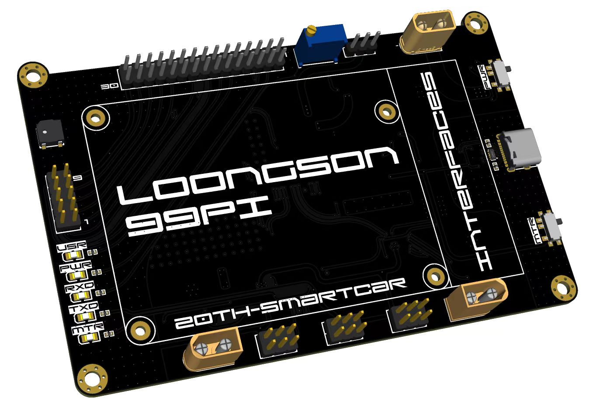
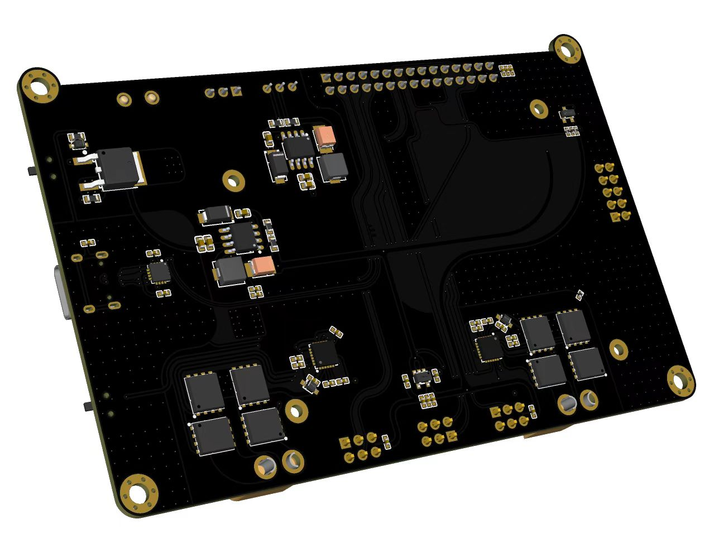
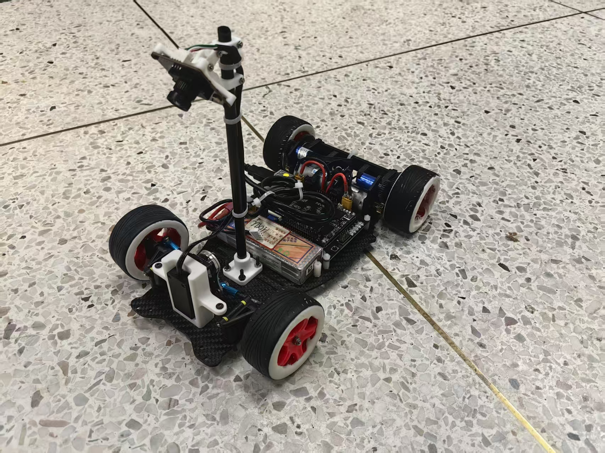

# 极速光电龙芯组全流程开源
> 作者很忙，请不要打扰他😽

# 目录结构
```
20th_loongson
├─docs              文档
├─env               环境配置
├─hardware          硬件工程
└─software          软件工程
```

# 跑动视频
- [代码跑动测试](https://www.bilibili.com/video/BV1PaX7Y8E8C/)
- [硬件未闭环跑动](https://www.bilibili.com/video/BV1U5R5YwEzK/)

<b>求一键三连🥰</b>

# 硬件图片
|正面 | 反面 |
| :-: | :-: |
|  |  | 



# 文档链接
| 文档类型 | 链接 |
| :-: | :-: |
| <b>环境配置</b> | 👉[click](../env/docs/README.md) |
| <b>硬件工程</b> | 👉[click](../hardware/README.md) |
| <b>软件工程</b> | 👉[click](../env/docs/README.md) |

# 寻求帮助
- <b>闲鱼🐟：Leeeezy</b>
<br>注：本人有权不进行回复，如果询问的问题有价值才进行回复

# 鸣谢
- i佬（llikara）,可以给i佬的仓库点个⭐
<br>👉[click](https://github.com/AirFortressIlikara/ls2k0300_peripheral_library)

# <br>☠️仅供参考，不允许商用！！！


